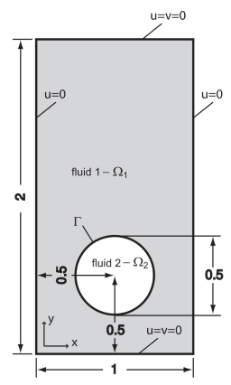
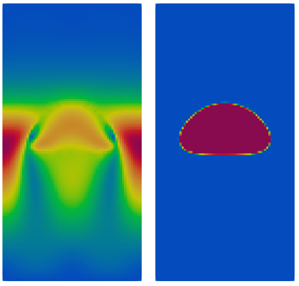
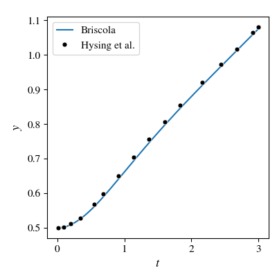
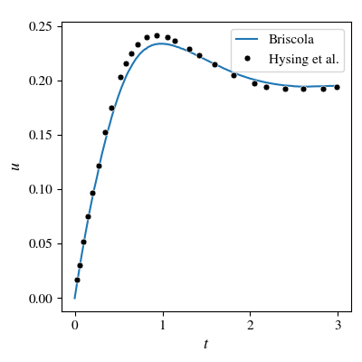

# Chapter 1: A first tutorial case

[Back to the table of contents](./0_start.md)

## Introduction

Running simulations with Briscola is very similar to running simulations with
OpenFOAM. Therefore, some experience with OpenFOAM is required before continuing
with Briscola. A good starting point for learning OpenFOAM is [OpenFOAM's user
guide](https://doc.cfd.direct/openfoam/user-guide-v12/index). It is recommended
that Briscola users are at least able to run standard OpenFOAM tutorial cases.

Just like OpenFOAM, Briscola uses the following key components:

1. Numerical discretizations schemes, algorithms, solvers and models are
   contained in `src`. Many of them are runtime selectable, meaning that the
   type is only selected at runtime based on user input using the [Factory
   method pattern](https://en.wikipedia.org/wiki/Factory_method_pattern). Most
   of Briscola's code is contained in the `src` directory.
2. Solvers, dynamically using the code in `src`, are contained in
   `applications/solvers` as executables. They set the high-level algorithm that
   is used to solve the set of PDEs. In Briscola, examples are the
   `briscolaColocated` and `briscolaStaggered` solvers, which are incompressible
   single-phase Navier-Stokes solvers using a colocated or staggered approach,
   respectively.
3. The specific problem definition (e.g., a channel flow, lid-driven cavity flow
   or a pipe flow) is contained in a `case`. The case instructs the solver about
   the mesh that must be generated (in Briscola this is done directly by the
   solver and not by an intermediate tool like blockMesh), about numerical
   discretization schemes, about solver parameters and about physical
   parameters. Just like in OpenFOAM cases, a `0` directory is used to define
   the fields and their boundary conditions and a `system` case is used to set
   various parameters in several dictionary files. For each solver, Briscola
   provides a number of example cases in the `cases` directory.

In this first chapter, one of the example cases will be explored.

## Hysing's rising bubble case

### Start

Some key components of Briscola are the use of a staggered grid and the
implementation of geometric two-phase volume-of-fluid advection schemes. To
demonstrate this, Hysing's rising bubble case will be simulated using the
`briscolaStaggeredTwoPhase` solver [Hysing, S., et al. IJNMF 60.11 (2009):
1259-1288.]. Hysing's case consists of a 1x2 domain with a bubble of size 0.5
that is initially stagnant and rises under gravity, as shown in the figure:



Before starting, make sure that OpenFOAM is loaded and that Briscola is
compiled. Every change to the Briscola code requires recompilation of the part
that was changed. Assuming that 1) you have downloaded Briscola, 2) changed
directory on the commandline to Briscola's root and 3) loaded OpenFOAM,
compiling Briscola can be done by
```
./Allwmake
```

The script will compile all individual libraries and applications, and may take
a while depending on your system. Once done, we can change directory to Hysing's
bubble case:
```
cd cases/briscolaStaggeredTwoPhase/Hysing
```
With `ls` you will see that the case has the following files and directories:

* `0`: Directory with boundary condition files for each solution field
* `clean.sh`: Bash script to clean-up the case after running
* `code`: Directory containing additional code needed for initialization of the
  problem and for post-processing the solution
* `plot.py`: Python script to plot the post-processed results
* `prep.sh`: Bash script to prepare the case
* `system`: Directory that contains case parameters including mesh and numerics

Most Briscola cases consist of these files. At a minimum, only the system and 0
directories must be provided. Most cases present in the cases directory have a
preparation and a clean script. In many cases, these scripts need to be aware of
the location where Briscola is installed. This must be explicitly set using the
`BRISCOLA` environment variable. The variable can be set using
```
export BRISCOLA=<Your Briscola installation location>
```
For example, if you have cloned Briscola into your `$HOME` under the directory
name `briscola`, then do:
```
export BRISCOLA=$HOME/briscola
```

This variable needs to be set every time a new shell is started it. It may
therefore make sense to make it part of your `.bashrc` file (if your shell is
Bash).

### Preparation

With the `BRISCOLA` environment variable set, we can now run the preparation
script in the Hysing case:
```
./prep.sh
```
Note that without the `BRISCOLA` variable, the preparation script will give an
error. By default, the preparation script will prepare the first Hysing case
(there are two cases in total). If the one wants to run the second Hysing case,
do `./prep.sh 2`. The preparation script will put in place some input files,
based on their macros. For example, the `system/briscolaTwoPhaseDict` will be
generated from the `system/briscolaTwoPhaseDict.m4` file, by replacing `VARRHO2`
and `VARMU2` by the proper values corresponding to the selected case . Have a
look at the contents of the `prep.sh` script.

The preparation script also compiles the code that is located in the `code`
directory. More specifically, it compiles the file
`code/functionObjects/Hysing/Hysing.C`. Inspecting this file, it can be seen
that two things are done:
1. In the `Hysing::read(...)` function, the volume fraction field alpha is found
   and manipulated. This function is called once during the startup phase of the
   solver. The alpha field is initialized as zero and set to unity inside the
   bubble.
2. In the `Hysing::execute()` function, both the alpha and U fields are found
   and post-processed, computing the quantities

   * $v = \int_\Omega \alpha\mathrm{d}\mathbf{x}$,
   * $\mathbf{h} = \frac{1}{v}\int_\Omega \alpha\mathbf{x}\mathrm{d}\mathbf{x}$ and
   * $\mathbf{u} = \frac{1}{v}\int_\Omega \alpha\mathbf{U}\mathrm{d}\mathbf{x}$

   as the bubble volume, bubble position and bubble velocity. These are then
   written to a file.

As opposed to OpenFOAM cases, what we do not need to do in Briscola is the
preparation of a mesh. The mesh generation process is part of the Briscola
solver, and is different from OpenFOAM because a brick-structured mesh is used
in Briscola and the structure of the cells must be known to the solver. Instead,
in OpenFOAM the mesh is unstructured and only owner-neighbor information is
known. The mesh in Briscola is always set by the information in the
`system/briscolaMeshDict` file. Have a look at this file: it looks very similar
to a `blockMeshDict` file of OpenFOAM. First, vertices are created and they are
used in the generation of bricks. In turn, edges on these bricks can be
controlled and patches are formed. Finally, a parallel decomposition of bricks
is performed, which automatically sets the number of processors that must be
used to run the case. A rule in Briscola is that a single process can contain at
most one brick, but not more than one brick. This means that if the mesh
consists of two bricks, at least two processes must be used to handle the mesh.
A brick may however be distributed across multiple processors. The decomposition
of a brick is always 'rectilinear', in the sense that the processor
decomposition of a single brick is a rectilinear 'mesh' in itself. In turn, this
means that the 'sub-bricks' are always rectilinear bricks too. This simplifies
the [data structure](data.md) in Briscola significantly.

### Running

From the `briscolaMeshDict` file we can see that the mesh has one brick, and
that this brick is decomposed in 2x2x1 processes. Thus, we need to run the case
using four processors in total. This can be done with
```
mpirun -np 4 briscolaStaggeredTwoPhase -parallel
```
The solver used here is `briscolaStaggeredTwoPhase` and it is invoked by mpirun
using four processors. Since it is a parallel run we need to specify the
`-parallel` argument to it, just like one would in an OpenFOAM simulation. More
on various solvers can be found in [Finite volume solvers](./finiteVolume.md)
and [Two-phase solvers](./twoPhase.md).

### Post-processing

The simulation runs for three time units before completing. It writes away data
every 0.1 time units, in the legacy VTK format, not in OpenFOAM's format. The
data can be read using ParaView, by starting the ParaView program (simply type
`paraview`, *not* `paraFoam`) and loading the `briscola_colocated.vtk.series`
file. While this is a staggered simulation, Briscola automatically calculates a
colocated velocity field that is more intuitive. Moving ParaView to time 3, the
following results are obtained for the velocity and volume fraction fields:



For staggered solvers, one can also load the separate staggered 'mesh
directions' in ParaView (see [Data structure](./data.md)), i.e., by loading
briscola_staggered_x.vtk.series or briscola_staggered_y.vtk.series. This will
then show the solution for each velocity component.

The Hysing case also has a Python script that post-processes results in a more
quantitative way. After running the case, the script can be run with
```
python plot.py
```
This requires Python with the Numpy module to be installed on the system. It
generates two plots in `y.pdf` and `u.pdf`, being the bubble upward position and
bubble upward velocity, respectively. They are shown here:




Good agreement is found with the reference data of Hysing.

The case can be cleaned up and brought back to its initial state by
```
./clean.sh
```

### Next steps

It is recommended that the Hysing tutorial case is studied in a bit more detail
before continuing. Do not forget to prepare the case again with the `prep.sh`
script. Some things that may be tested are the following:

* Change the mesh resolution, by modifing the brick definition in
  `system/briscolaMeshDict`
* Play around with different physical values of the problem in
  `system/briscolaTwoPhaseDict.m4`, or use a different normal, surface tension
  or curvature scheme. Note that when manipulating the m4-file, the preparation
  script must be run again to update the corresponding input file. Tip: in order
  to list the available schemes, set some random value for the scheme and run
  again. An error will now be given, and the available schemes will be listed.
  This 'method' can be used for all dictionary parameters, also in other input
  files.
* Play around with different Runge-Kutta time integration schemes in
  `system/briscolaSchemeDict`. Use the tip of the previous point to show which
  Runge-Kutta schemes are available.

[Back to the table of contents](./0_start.md)
or [Next chapter: data structure](./2_data.md)