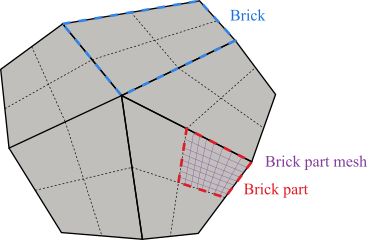
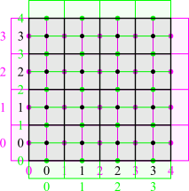
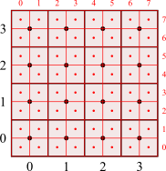
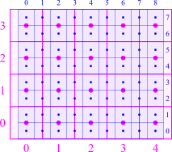
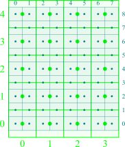

# Chapter 2: Data structure

[Back to the table of contents](./0_start.md)

## Brick-structured mesh decomposition

An important aspect of Briscola is the way that data is managed. Data management
in Briscola is inherently *parallel* in a distributed memory sense. Since
Briscola is 'brick-structured', meaning that the numerical mesh is built out of
rectangular 'bricks' (i.e., hexahedrons), data can be managed in quite a simple
way. One important rule is that each processor contains *at most one brick*.
Thus, the number of processors required is at least equal to the number of
bricks. But also more than one processor can be assigned to one brick. A second
rule is then that the number of processors assigned to each brick must be such
that the brick can be distributed across those processors in equal parts, with
each part being a hexahedron too. In turn, this means that the numerical mesh
contained by each processor is always a hexahedron, and the numerical mesh
contained by each processor is therefore always *structured*. This is very
useful when managing data: each processor only has to keep track of a
three-dimensional structured *block* of data which can be indexed using three
indices $(i,j,k)$.



The figure above shows the geometric ordering of the data structure in Briscola.
The front view of a three-dimensional mesh is shown (in Briscola, a mesh is
always three-dimensional), consisting of five bricks (thick black lines) such as
the one marked in blue. The mesh is unstructured as there exists a vertex which
is contained by more than four bricks (the central vertex). Each brick is
decomposed by four brick parts such as the one marked in red. The mesh contained
by that brick part is shown in purple. The data associated with the mesh as
shown above is, by definition, stored on 20 processors (five bricks having each
four brick parts). The minimum number of processors that the mesh would require
is five (five bricks). One may also use more than 20 processors. However, the
processor decomposition of each brick should be such that the decomposition on
brick faces and edges are the same across all bricks that share those faces and
edges. As said, each brick part contains a structured mesh as shown by the
purple mesh.

## The block class

The structured nature of each brick part allows to define a very simple data
structure on each processor. In Briscola, the main 'building block' for data is
the `block` class. The block class is essentially a wrapper around a simple C
array, automatically handling indexing. The following code snippet shows how a
`block` can be created and used:

```
block<label> B(2,3,4);

forAllBlock(B, i, j, k)
{
    B(i,j,k) = i*j*k;
}

block<label> BSquare(B*B);
```

A label block `B` of shape $(2,3,4)$ is created and filled with data using the
`forAllBlock` iterator. Then, a second label block is created as the
element-wise square of `B`.

The underlying storage of data inside the block class is in a simple C array.
The ordering of the data is such that the three-dimensional loop
```
for (int i = 0; i < B.l(); i++)
    for (int j = 0; j < B.m(); j++)
        for (int k = 0; k < B.n(); k++)
            B(i,j,k) = ...;
```
walks through the data in a contiguous way. In fact, the `forAllBlock` macro
performs exactly this three-dimensional loop. Note that the `l()`, `m()` and
`n()` member functions of the `block` class return the data size in the local
$x$, $y$ and $z$-directions.

The block class is templated for primitive types such as scalar, vector, tensor,
etc. Thus, it can handle all sorts of data associated with hexahedron objects.
Have a look at `applications/test/block/Test-block.C` for all the things that
are possible with blocks. There are many operators and functions defined for
blocks, analogously to OpenFOAM lists, fields, etc.

## Mesh directions

Just like OpenFOAM, Briscola largely relies on finite volume discretizations.
Much of the code is contained in the briscolaFiniteVolume library. Associated
with discretizations are fields, boundary conditions, schemes and solvers. They
require some sort of data structure of the eventual solution variables such as
pressure, temperature or velocity. Discretizations in Briscola are both
*colocated* (like OpenFOAM) but can also be *staggered*. This data structure is
an intrinsic part of Briscola, and is programmed in an abstract sense. Data
fields, boundary conditions, schemes and solvers are not just templated for a
primitive type (like scalar, vector, tensor) but also for the mesh type (i.e.,
colocated or staggered). As is known, staggered discretizations offer superior
numerical properties such as conservation of energy and are thus worthwhile to
consider in high resolution simulation. Moreover, staggered discretizations
seamlessly integrate with structured meshes as Briscola is designed to handle
efficiently.



The figure above shows a colocated and staggered mesh arrangement. In black is
the colocated mesh, which exactly maps the domain of the brick part for each
processor. Mesh points are defined in the barycenter of each cell, and fields
are defined on these cell centers. Indexing is as indicated by the black
numbers, starting from the left-bottom-aft which has ID $(0,0,0)$ and ending at
the right-top-fore which has ID $(N_x-1,N_y-1,N_z-1)$ (the figure obviously only
shows two dimensions).

Next, the staggered mesh actually consists of three meshes: one that's shifted
half a cell to the left and padded by an additional layer on the right (the
purple one), one that is shifted half a cell to the bottom and padded by an
additional layer on the top (the green one), and, by extension, one that is
shifted by half a cell to the aft and padded by an additional layer on the fore
(not shown in the figure). The centers of the staggered cells are, by
definition, located on the face centers of the colocated cells. We refer to each
staggered mesh as a *mesh direction*. In general, the colocated mesh has just
one mesh direction while the staggered mesh has three mesh directions. By
extension, one could even define an 'edge mesh' (a shift in two directions) and
'vertex mesh' (a shift in three directions). While this is not currently
implemented, the abstraction of the mesh type allows for that readily.

The benefit of templating fields, boundary conditions, schemes and solvers for
the mesh type is that most code can be written generically without having
special treatments for different mesh types. The only requirement is that when
iterating over cells, an additional outer loop is invoked that iterates over the
mesh directions. The following code iterates over all cells in a field `f` (the
type of which will be discussed momentarily) and fills it with data:
```
forAllCells(f, d, i, j, k)
{
    f(d,i,j,k) = d*i*j*k;
}
```
The `d` integer corresponds to the direction number. The `forAllCells` iterator
automatically accounts for padding of staggered mesh directions.

Finally, you may have a look at:

* `src/briscolaFiniteVolume/fields/meshTypes/colocated.C` and
* `src/briscolaFiniteVolume/fields/meshTypes/staggered.C`

These two files solely define the properties of the colocated and staggered mesh
types, which are `numberOfDirections`, `directionNames`, `padding` and `shift`.

## Mesh levels

Another aspect that is intrinsically built into Briscola is the concept of *mesh
levels*. The structured nature of the data on each processor allows for a simple
geometric coarsening of cells, simply by combing each cube of 2x2x2 cells into
one. When $N_x$, $N_y$ and $N_z$ are powers of two, or powers of two multiplied
by 3, then this coarsening can be repeated until a very coarse mesh is obtained
with at most 3x3x3 cells. This coarsening generates a hierarchy of meshes that
are extremely useful if solving partial differential equations in the context of
*multigrid solvers*. Since smoothers such as Gauss-Seidel or Jacobi are good at
smoothing high frequency errors, but not good at smoothing low frequency errors,
coarsening the problem and solving related defect equations while extrapolating
their solutions back to finer levels dramatically increases the performance of
these smoothers. As it turns out, this yields solution algorithms with
$O(N)$-complexity, with $N$ the total number of cells.





The three figures above show one colocated and two staggered mesh directions.
For each figure, a fine grid is shown with a coarser child mesh. Briscola
contains many schemes that handle data transfer, using interpolation, from fine
to coarse (restriction) and coarse to fine (prolongation).

## Mesh fields

Mesh levels and directions are built into fields. A field can be made 'shallow'
or 'deep', meaning that it only has one level (the finest one) or the full
cascade of levels. The nice thing about having levels built into fields is that
any operation on the field can automatically be applied to all levels, as
demonstrated by the following code:
```
f.restrict();
g.restrict()
h = f*g;
```
Here, we have three fields `f`, `g` and `h`. The first two are made deep and the
coarser levels are iteratively populated by restriction of the fine level. Then,
`h` is computed as the product of `f` and `g`, which automatically takes into
account the fact that these fields are deep.

Also the `forAllCells` iterator can handle levels. For example, we may iterate
over `h` as follows:
```
forAllCells(h, l, d, i, j, k)
{
    h(l,d,i,j,k) = ...;
}
```
The iterator will automatically loop over all levels, and the range of $(i,j,k)$
will automatically adjust based on the level. If a field is deep, we may still
access it by using `f(d,i,j,k)` to access the first (finest) level directly. In
fact, we may even use `f(i,j,k)` to access the first mesh direction of the first
mesh level directly. Clearly, each level automatically consists of the number of
directions that matches the mesh type (one for colocated, three for staggered).

As such, mesh fields are templated for both a primitive type (scalar, vector,
...) and a mesh type (colocated or staggered). The definition of the meshField
class is thus:
```
template<class Type, class MeshType>
class meshField;
```
So that `meshField<scalar,colocated>` would denote a colocated scalar field.
Briscola also defines short-hand typedefs. In the case of the colocated scalar
field, the short-hand type would be `colocatedScalarField`. Have a look at

* `src/briscolaFiniteVolume/fields/colocatedFields/colocatedFieldsFwd.H` and
* `src/briscolaFiniteVolume/fields/staggeredFields/staggeredFieldsFwd.H`

for all such types.

[Back to the table of contents](./0_start.md)
