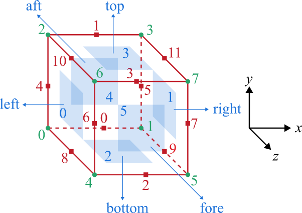

# Chapter 3: Making a mesh

[Back to the table of contents](./0_start.md)
or [Previous chapter: Data structure](./2_data.md)

## Brick-structured mesh decomposition

As already stated in the previous chapter (read it first if not yet done!),
Briscola is a brick-structured code. The domain $\Omega$ is comprised by a
number of bricks that are each hexahedron as shown here:


In turn, a brick can be decomposed by a number of brick parts in a structured
way. Thus, each brick part is a hexahedron too, and can be mapped by a fully
structured mesh. The processor decomposition of each brick should be such that
the decomposition on brick faces and edges are the same across all bricks that
share those faces and edges.

To define the mesh, just like OpenFOAM a case-specific dictionary file is used.
In Briscola, this file is `system/briscolaMeshDict`. The objective of this
dictionary file is to define vertices, bricks, edges, patches and the
decomposition. A difference with OpenFOAM is that in Briscola the decomposition
of the mesh cannot be as arbitrary. The rule is that each processor must have a
part of the mesh that is structured, meaning that it can have at most one brick.
The reason for this, as explained in the previous chapter, is that it
drastically simplifies data management. As in the example above, each processor
has a brick part which is a quarter of a brick and is thus also a hexahedron.
The decomposition of the mesh in Briscola is quite straight-forward, and can be
handled best as an intrinsic part of the mesh. Moreover, some methods used in
Briscola require a 'full picture' of the full domain and its decomposition.
Thus, the shape and decomposition of the mesh must be known to all processors
whereas in OpenFOAM domain decomposition is designed to split the problem into a
number of strictly local problems.

In this chapter meshing in Briscola is discussed.

## Mesh element numbering



Before the mesh dictionary file is discussed we first define a few numbering
and naming conventions in Briscola. Referring to the figure above, a brick or
brick part is constructed from 8 vertices, 12 edges and 6 faces. In a
right-handed local coordinate system aligned with this brick, the two faces with
normal in $x$ are called *left* and *right*, the two faces with normal in $y$
are called *bottom* and *top* and the faces with normal in $z$ are called *aft*
and *fore*. They are often abbreviated to *l*, *r*, *b*, *t*, *a* and *f*. Using
these abbreviations, edges and vertices can be denoted by combinations of two or
three of them, respectively. For example, the left-bottom-aft vertex would be
*lba*, the left-aft edge directed in $y$-direction would be *la*, etc.

A specific lexicographic ordering of edge and vertex numbering is followed that
generally goes 'from $x$ to $z$'. The first vertex labeled '0' is the
left-bottom-aft (lba) one. Then, moving in $x$-direction, the next vertex
labeled '1' is the right-bottom-aft (rba) one. The third vertex labeled '2' is
at left-top-aft (lta) and the fourth vertex labeled '3' is at right-top-aft
(rta). The final four vertices (lbf, rbf, ltf and rtf) have the same ordering
but are on the fore face. The vertex numbers are indicated in the figure above
using the green numbers. Because Briscola is written in C++, counting starts at
zero and not at one.

Edges are sorted in a similar way. The first four are those directed in
$x$-direction, the second four those directed in $y$-direction and the final
four in $z$-direction. The $x$-directed edges are the bottom-aft (ba) one with
number 0, the top-aft (ta) one with number 1, the bottom-fore (bf) one with
number 2 and the top-fore (tf) one with number 3. Following the same logic, the
$y$-directed edges are la, ra, lf, rf and the $z$-directed edges are lb, rb, lt
and rt.

Have a look at `src/briscolaCore/include/utils.H` for some elementary
definitions and corresponding ASCII drawings in the comments.

## Vertices, bricks, edges and patches

Just like OpenFOAM, in Briscola a mesh is defined from vertices, bricks (blocks
in OpenFOAM), edges and patches. The format of system/briscolaMeshDict is
```
vertices
(
    (0 0 0)
    (1 0 0)
    (0 1 0)
    (1 1 0)
    ...
);

bricks
(
    0
    {
        vertices    (0 4 2 6 1 5 3 7);
        N           (16 32 48);
    }

    ...
);

edges
(
    (0 1)
    {
        type    arc;
        point   (0 -1.0 0);
    }

    ...
);

patches
(
    name
    {
        type        patch;
        faces
        (
            (0 1 2 3)
            (4 5 6 7)
            ...
        );
    }

    ...
);

decomposition
{
    type    manual;

    brickDecompositions
    (
        (1 2 3)
        ...
    );
}
```
There are 5 key entries: `vertices`, `bricks`, `edges`, `patches` and
`decomposition`. The `vertices` entry contains a simple list of coordinates
defined with respect to a global right-handed coordinate system. The `bricks`
entry contains a collection of numbered dictionaries where each dictionary
defines a brick. A brick is defined by its 8 vertices, and the number of mesh
cells in each local direction. The vertices are stored in a list that is ordered
lexicographically and would be the output of
```
for (i = 0; i < 2; i++)
    for (j = 0; j < 2; j++)
        for (k = 0; k < 2; k++)
            Info<< vertices(i,j,k) << nl;
```
This means that the first vertex is lba, the second is lbf, the third is lta,
the fourth is ltf and so on for the right brick face. The reason for this
ordering is that the underlying data in a block is also stored in this order,
and it is therefore very simple to read in the vertices in this order. The `N`
entry in each brick dictionary defines the number of cells in each direction
inside the brick.

The `edges` entry contains a collection of named dictionaries defining edges. In
principle, edges do not need to be defined explicitly because they follow
immediately from the brick definition. However, when edges are not straight
lines, they can be explicitly defined in the `edges` entry. In particular, an
arc can be defined as indicated. The name of the dictionary is the list of two
vertices that define the edge. For an arc edge, the `point` entry defines a
point in between the two vertices through which the arc should pass.

The `patches` entry defines the boundaries of the domain. A patch is a
collection of external faces that enclose the mesh domain. The `patches` entry
contains a collection of named dictionaries, each defining a patch. A patch has
a `type` entry defining the type of the patch and a `faces` entry which is a
list of vertex lists, with each vertex list being a slice of the vertex block
that defines a brick. Thus, the ordering of the vertices in this vertex list is
the same as the ordering of vertices in the brick definition. Any external brick
faces that are not added explicitly to patches are added to the 'default' patch.

Finally, the `decomposition` entry defines for each brick its decomposition.
Currently, only a manual decomposition type is supported, meaning that brick
decompositions must be specified manually by means of an integer vector that
spans the 'rectilinear' decomposition of the brick. The total number of
processors is, by definition, the product of the three components of each
decomposition vector, summed over all bricks.

For a more complicated example, have a look at the unstructured pipe flow mesh
in `cases/briscolaColocated/pipeFlow` or
`cases/briscolaColocated/flowOverCylinder`. The `briscolaMeshDict` file can be
generated with the `prep.sh` script, i.e.,
```
./prep.sh
```
The mesh has five bricks that form an unstructured cylindrical mesh. By default,
each brick is decomposed in four brick parts, thus requiring 20 processors in
total.

## Mesh hierarchy

Since Briscola is a brick-structured code, globally a mesh can be
*unstructured*. Here, 'unstructured' means that the connectivity graph of bricks
does not form a 3D lattice. This is checked by the `buildTopologyMap()` function
in `src/briscolaMesh/brick/brickTopology.C`, where such a 3D lattice graph is
built and if this process fails the mesh is said to be unstructured. For
example, a mesh is unstructured when there is an edge that is enclosed by a
number of bricks that is unequal to four. If the `buildTopologyMap()` function
succeeds, the mesh is called *structured*.

Even when the mesh is structured, we may characterize the mesh in more detail. A
structured mesh may be *rectilinear*, when its vertices can be generated from
just three vectors and a base tensor. More precisely, a mesh is rectilinear if
all points at some constant index $i$, $j$ or $k$ sit on the same plane. The
columns of the base tensor form the normal vectors of those planes, for each
direction. If the points in the three rectilinear vectors are uniformly
distributed, then the mesh is called *uniform*.

Since a uniform mesh is also a rectilinear mesh, and a rectilinear mesh is also
a structured mesh, and since a structured mesh carries all the relevant features
of an unstructured mesh, we may have the following hierarchy:
```
class uniformMesh
    : class rectilinearMesh
        : class structuredMesh
            : class unstructuredMesh
                : class mesh;
```
I.e., `uniformMesh` is derived from `rectilinearMesh`, `rectilinearMesh` from
`structuredMesh`, etc. In fact, the type of the `mesh` object that is generated
by the `fvMesh` class is automatically adjusted based on the input provided by
the user in the `briscolaMeshDict` file. Using type casting, the `mesh` object
can be 'upcasted' to another type. For example, the FFT solver used in Briscola
requires a mesh to be at least rectilinear. Thus, a cast is performed to the
`rectilinearMesh` type, and all properties of that type can then be used. In
this snippet:
```
const PtrList<PartialList<scalar>>& cellSizes
    = fvMsh.msh().cast<rectilinearMesh>().globalCellSizes();
```
the `mesh` object is obtained from the finite volume mesh object `fvMsh`, then
cast to the `rectilinearMesh` type, of which a reference is obtained to the
global cell sizes pointer list, which contains three vectors with cell sizes in
the three base directions and is, of course, only defined for a rectilinear
mesh.

## Inspecting a mesh

When designing a mesh it is useful to view it. In Briscola, unlike OpenFOAM, the
mesh is not written to disk. Instead, the mesh is generated every time a solver
is started. This can be done because the mesh generation process is relatively
simple due to the simple brick-structured data structure. Simulation data is
written in the legacy VTK format. Using that data, the mesh may be viewed. With
the `briscolaWriteMesh` utility, the mesh can be written in VTK format and read
in ParaView. Since the mesh is generated only at runtime, and since the mesh
decomposition is an intrinsic part of the mesh in Briscola, this application
must be run in parallel when the mesh has a parallel decomposition. Thus:
```
cd cases/briscolaColocated/cavity
./prep.sh
mpirun -n 4 briscolaWriteMesh -parallel
```
This will write all levels of the mesh in colocated format, and also in
staggered format if the mesh is structured (which is the case for the cavity
case). The mesh can be read in ParaView by loading the corresponding `.series`
file.

It is also possible to extract more information from the mesh. Using the
`briscolaCheckMesh` utility, the mesh is checked for consistency. Also, using
the `-brickInfo`, `-levelInfo`, `-parallelInfo`, `-parallelConnectivityInfo` and
`-patchInfo` arguments, respective information can be obtained. Again, the
application must be run in parallel if the mesh is decomposed. For example,
```
cd cases/briscolaColocated/cavity
./prep.sh
mpirun -n 4 briscolaCheckMesh -patchInfo -parallel
```
will show patch information of the cavity case mesh.

[Back to the table of contents](./0_start.md)
or [Next chapter: The Finite Volume library](./4_finiteVolume.md)
