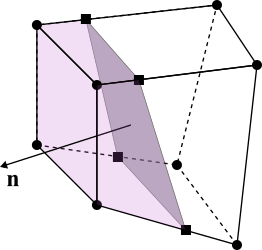

# Chapter 5: Two-phase solvers

[Back to the table of contents](./0_start.md)
or [Previous chapter: The Finite Volume library](./4_finiteVolume.md)

An important part of the Briscola is its two-phase flow simulation capability.
Since each processor has a structured mesh, this means that each cell is
a hexahedron. In turn, proven algorithms can be used to capture a two-phase
interface. We do this in the context of the Volume Of Fluid (VOF) method, with
geometric reconstruction. While it can be tedious to implement, this method is
superior in terms of computational efficiency compared to algebraic interface
capturing methods. On relatively coarse meshes, sharp interfaces may be captured
in a way that does not produce too much numerical error.

Briscola's VOF approach revolves around the solution of the volume fraction
equation

$\frac{\partial\alpha}{\partial t} + \mathbf{u}\cdot\nabla\alpha = 0$

In principle, this could be done algebraically. However, it is well known that
solutions for the volume fraction $\alpha$ then become either non-monotonic
using high-order schemes or diffuse using limited schemes (pick one). As an
alternative, we may exploit the hyperbolic nature of the equation above by
tracking characteristics on which the solution for $\alpha$ is constant. For
this, however, the precise geometry of the interface must be reconstructed
mathematically. Hence, methods that follow this approach are called 'geometric'
advection methods.

## Geometric advection

The geometric advection method implemented in Briscola follows the work of
Weymouth, G.D., and Yue, D.K.P. "Conservative volume-of-fluid method for
free-surface simulations on cartesian-grids." Journal of Computational Physics
229.8 (2010): 2853-2865. It contains the following steps:

1. Given a discrete colocated solution $\alpha^n$ at time level $n$, reconstruct
   the interface normal $\mathbf{n}$ for each interfacial cell (i.e., each cell
   for which $0<\alpha^n<1$). There are several normal reconstruction algorithms.
   The simplest one is Young's algorithm, which computes $\mathbf{n}$ from the
   gradient of $\alpha^n$. Briscola also has more advanced algorithms, such as
   LSFIR, LSGIR and MYC, see `src/briscolaTwoPhase/normalSchems`.
2. With $\alpha^n$ and $\mathbf{n}$ known, we may reconstruct a planar interface
   in each interfacial cell. Consider this figure:

   

   An arbitrary hexahedron is shown, for which $\alpha^n$ and $\mathbf{n}$ are
   known. Since $0<\alpha^n<1$, one could draw a planar surface through the
   hexahedron such that the truncated volume (marked in purple) of the
   hexahedron is equal to $\alpha^n V$ with $V$ the cell volume. All points
   $\mathbf{x}$ on this plane satisfy the equation

   $\mathbf{n}\cdot\mathbf{x} = C$

   with $C$ the 'intercept' constant which must be computed. The problem of
   finding $C$ is referred to as the Local Volume Enforcement (LVE) problem.
   Briscola has two algorithms implemented for solving the LVE: the CIBRAVE
   algorithm (López, Joaquín, et al. "A new volume conservation enforcement
   method for PLIC reconstruction in general convex grids." Journal of
   Computational Physics 316 (2016): 338-359.) for general hexahedra and an
   analytical algorithm (Scardovelli, R., and Stephane Z.. "Analytical relations
   connecting linear interfaces and volume fractions in rectangular grids."
   Journal of Computational Physics 164.1 (2000): 228-237) for parallelepiped
   quadrilateral hexahedra, see the code in `src/briscolaTwoPhase/LVE`.
3. With the interface reconstructed, we may simply use the method of
   characteristics to track lines in time and space on which the solution for
   $\alpha^n$ remains constant. To do this in a monotonic and mass-conserving
   way, the split advection approach of Weymouth & Yue is used which only works
   on structured grids. Given the truncation plane, we may exactly compute the
   flux through the $x$-faces of the hexahedron given a velocity at the $x$-faces
   while setting the velocities on the $y$- and $z$-faces to zero. This then
   gives an intermediate solution $\alpha^\star$. Now, step 1-3 can be repeated
   with $\alpha^\star$ as the initial solution (thus requiring a new
   reconstruction of $\mathbf{n}$ and $C$), with the only difference that
   advection is now done in the $y$-direction, giving an intermediate solution
   $\alpha^{\star\star}$. Finally, steps 1-3 are repeated in the $z$-direction to
   give the final solution $\alpha^{n+1}$.

By making some clever interpolation choices, Weymouth & Yue showed that this
leads to a method that is monotonic and mass-conserving while preserving
sharpness of the interface. See
`src/briscolaTwoPhase/vof/splitAdvection/splitAdvection.C` for Briscola's
implementation of this algorithm.

## Surface tension and curvature

To capture surface tension, the momentum equation is amended by Brackbill's
continuum surface tension term given by $\sigma\kappa\nabla\alpha$ with surface
tension $\sigma$ and interfacial curvature $\kappa$. The calculation of $\kappa$
is not a trivial task. Briscola has a few methods implemented that are in
`src/briscolaTwoPhase/curvatureSchemes`. The simplest is the `CV` method, which
computes the curvature from $\kappa = -\nabla\cdot\mathbf{n}$ with $\mathbf{n}$
computed using Young's method. More advanced methods are the height function
approach implemented in `SHF` or a parabolic fit method implemented in
`parabolicFit`.

## Two-phase solvers

Briscola has dedicated two-phase solvers that are colocated or staggered and use
Runge-Kutta or CNAB time integration (see
[Chapter 4](./4_finiteVolume.md)). The solution algorithm in these solvers is the same.
First, the volume fraction equation is solved as discussed above in the
`twoPhase.correct()` function call. Given a new solution for $\alpha^{n+1}$, a
new density field is computed and interpolated to faces, either staggered or
colocated. Next, a momentum equation predictor is solved. However, as opposed to
single-phase solvers, this momentum equation has a variable density that cannot
be absorbed in the pressure and viscosity. Thus, the variable density remains as
a coefficient in the right-hand side of the momentum equation, which is written
in a 'non-conservative' formulation. Moreover, the density now also appears in
the pressure equation which is of the form

$\nabla\cdot\left(\frac{1}{\rho}\nabla p\right) =
    \frac{\nabla \cdot \mathbf{u^\star}}{\Delta t}$

See [Solvers](./7_solvers.md) for a discussion on how this equation can be
solved. Finally, once a new pressure is obtained the velocity prediction can be
corrected, just like single-phase solvers.

An additional contribution to the momentum equation in two-phase flows is
buoyancy. To avoid pressure jumps across periodic boundaries that are normal to
the gravity vector, we use the following formulation:

$\frac{\partial\mathbf{u}}{\partial t} + \ldots =
    \ldots + \frac{\rho - \overline{\rho}}{\rho} \mathbf{g}$

where $\overline{\rho}$ is the volumetric average of the mass density and
$\mathbf{g}$ is the gravitational acceleration vector. The term
$-\overline{\rho}\mathbf{g}$ removes the hydrostatic pressure from the pressure
$p$, such that $p$ can be periodic without jump.

## Two-phase coefficients

Each two-phase case has its two-phase coefficients defined in
`system/briscolaTwoPhaseDict`. This file defines coefficients such as gravity
$\mathbf{g}$, mass densities $\rho_1$ and $\rho_2$ and viscosities $\mu_1$ and
$\mu_2$. Here, as a convention, the subscript 1 refers to the phase where
$\alpha = 0$ and the subscript 2 refers to the phase where $\alpha = 1$.

The `briscolaTwoPhaseDict` file also defines the two-phase algorithms and models
to be used. The normal reconstruction scheme, surface tension scheme, curvature
scheme, surface tension and VOF scheme can be chosen. Have a look at the
`briscolaTwoPhaseDict` file in Hysing's case as also discussed in the
[Tutorial](./1_tutorial.md).

[Back to the table of contents](./0_start.md)
or [Next chapter: Immersed boundary methods](./6_ibm.md)
