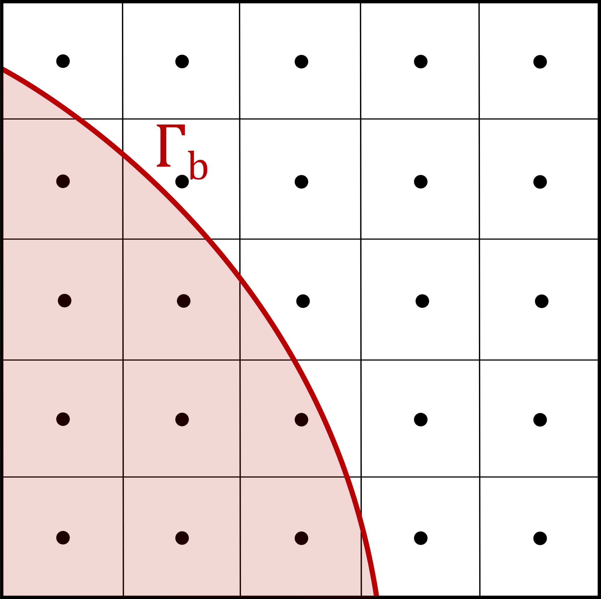
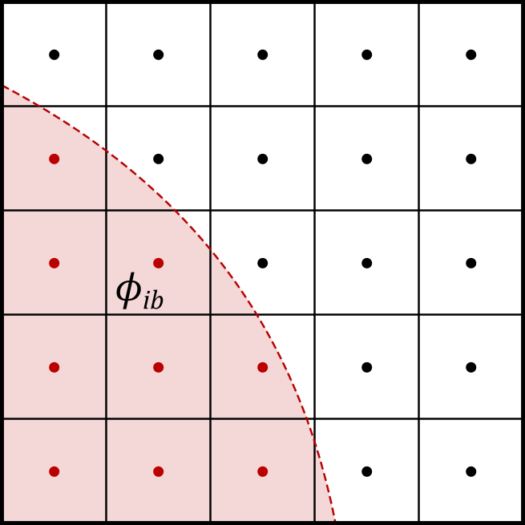
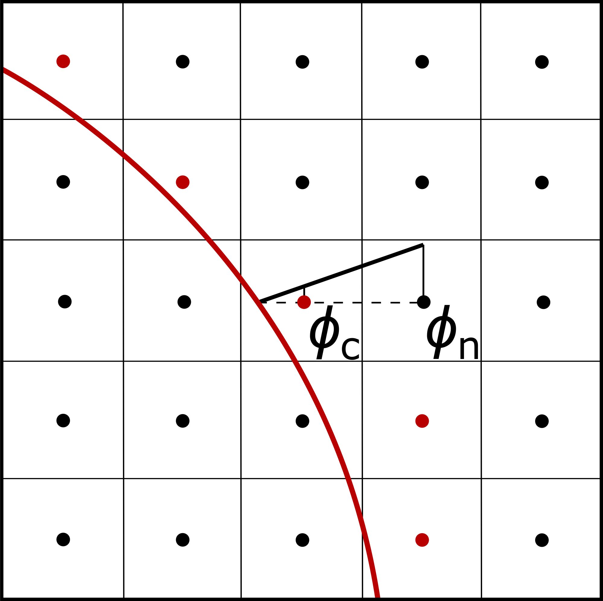
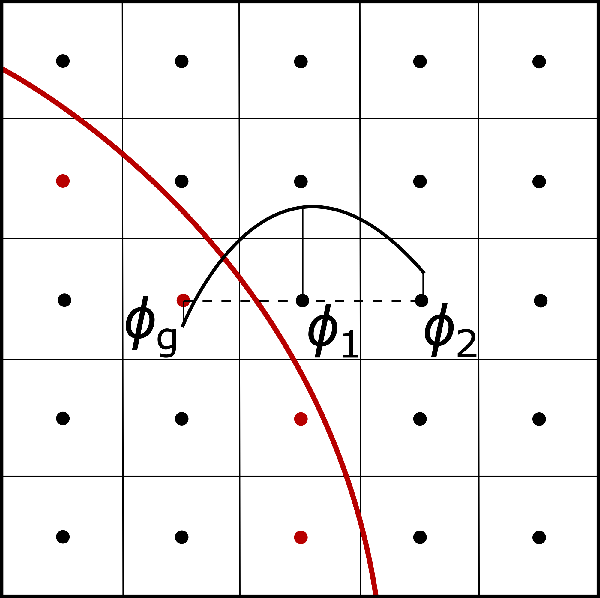
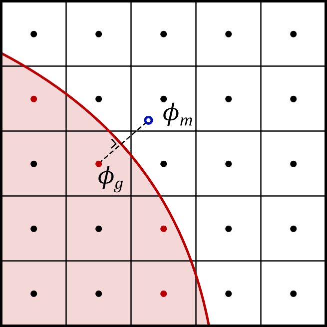

# Chapter 6: Immersed boundary methods

[Back to the table of contents](./0_start.md)

## Introduction

Briscola uses the immersed boundary method (IBM) to enable simulations in
complex geometries on orthogonal meshes. In the IBM approach, a complex
boundary shape $\Gamma_b$ arbitrarily cuts through the orthogonal mesh:



Instead of directly applying boundary conditions on cell- or face-centered
values, the IBM applies (approximate) boundary conditions on $\Gamma_b$ by
modifying the discretized linear system in the surrounding cells. The use of
IBM can significantly simplify the meshing process, while also maintaining the
advantages of orthogonal meshes: staggered fields, accurate geometric VOF
interface reconstruction, FFT solver, etc.

## Defining the immersed boundary

In Briscola, an immersed boundary can be defined as a list of shape objects.
These shapes (spheres or cylinders) are defined analytically, allowing for an
exact knowledge of the location of the immersed boundary surface. Immersed
boundaries in Briscola are fixed in time and space, and can therefore not be
used to model moving objects in a fixed frame of reference. Users may specify
any number of immersed boundaries in `system/briscolaMeshDict`, each containing
any number of shapes. Spheres are defined by the coordinate vector of the
center of the sphere as well as a radius, while cylinders are defined by two
coordinate vectors corresponding to points on the cylinder axis, as well as a
radius. Cylinders objects are infinite in length. Additionally, the `inverted`
argument (which defaults to `false`) can be set to true if the flow is intended
to occur inside of the shape object, instead of around it (e.g., for a pipe
flow). The following is an example of an immersed boundary entry in
`system/briscolaMeshDict`:

```
immersedBoundaries
{
    pipeWall
    {
        // Inverted cylinder along the z-axis, used here as a pipe wall.
        cylinder1
        {
            type    cylinder;
            start   (0 0 0);
            end     (0 0 1);
            radius  0.03;
            inverted true;
        }
    }

    obstacles
    {
        // Cylindrical obstacle oriented along x-axis, at a height of z=1.
        cylinder2
        {
            type    cylinder;
            start   (0 0 1);
            end     (1 0 1);
            radius  0.01;
            inverted false;
        }

        // Spherical obstacle at the center of the pipe, at a height of z=1.2.
        // Will default to inverted=false.
        sphere1
        {
            type    sphere;
            center  (0 0 1.2);
            radius  0.01;
        }
    }
}
```

In the above example, two immersed boundaries are constructed, namely
`pipeWall` and `obstacles`. For each of these immersed boundaries, boundary
conditions can be specified in `0/<fields>`. Immersed boundary conditions are
set in the same way as standard boundary conditions, but different options are
available for immersed boundary conditions, corresponding to different methods.
The immersed boundary conditions available are:
* `penalizationDirichlet`
* `FadlunDirichlet`
* `VremanDirichlet`
* `MittalDirichlet`
* `MittalNeumann`
* `Empty` - no immersed boundary condition applied to the field

## Penalization IBM

The penalization method is one of the simplest and most straightforward ways of
enforcing an immersed Dirichlet boundary condition. In the penalization method,
all of the points that lie inside of the immersed boundary are marked, and the
desired boundary value specified by the `values` option is applied in those
cells. With this method, the real immersed boundary ends up being approximated
by a staircase shape:



While the penalization is very simple and robust, the boundary condition is not
actually applied at the location of the immersed boundary, which can limit the
accuracy of the method.

## Fadlun IBM

In the method of Fadlun [Fadlun, E.A., et al. (2000). JCP, 161.1 : 35-60.], the
value is enforced on the first layer of cells on the outside of the immersed
boundary. In these wall-adjacent cells, the enforced value $\phi_c$ is set
according to a linear profile between the exact location of the interface in
the direction of the mesh and the second wall-adjacent cell with value
$\phi_n$:



The wall-adjacent cell values are forced according to the following relation:

$\phi_c = \frac{\xi_c \phi_n + \phi_b}{\xi_n}$,

where $\phi_b$ is the desired value at the immersed boundary, and $\xi_c$ and
$\xi_n$ are the values of the function $\xi$ at the wall-adjacent and
neighboring fluid cell respectively. The function $\xi$ gives the distance to
the wall along the chosen mesh direction, made dimensionless with the cell
center-to-center distance.

In this method, the desired boundary value is enforced at the exact location of
the immersed boundary, provided that the immersed boundary can be described
analytically such that the wall-distance may also be calculated analytically.

## Vreman IBM

The Vreman Dirichlet immersed boundary condition is based on the approach
presented in [Vreman, A.W. (2020). JCP, 423 : 109783]. In this IBM, the field
being forced is assumed to follow a quadratic profile near the boundary.
Unlike the originally presented method, the method is implemented in Briscola
by forcing the velocity on the first layer of cells inside of the immersed
boundary, while the original paper instead proposes to modify the coefficients
of the linear system on the outside of the immersed boundary. This change was
added to ensure that the method could also be compatible with explicit or
semi-implicit temporal discretization schemes.

The values $\phi_g$ at the ghost cells (i.e., the first layer of cells on the
inside of the immersed boundary) are set as a function of the two
wall-adjacent layers of cells on the outside of the immersed boundary,
$\phi_1$ and $\phi_2$:



The following relation is used:

$\phi_g = \phi_b + w_1\phi_1 + w_2\phi_2$,

where $\phi_b$ is the desired value at the immersed boundary, and the weights
$w_1$ and $w_2$ are given by:

$w_1 = \xi_g$, $w_2 = -\xi_g$,

where $\xi_g$ is the distance between the ghost cell and the immersed boundary,
made dimensionless with the cell center-to-center distance.

## Mittal IBM

The Mittal IBM [Mittal, R., et al. (2008). JCP, 227.10 : 4825-4852], similarly to
the Vreman IBM, forces the value $\phi_g$ in the ghost-cells inside if the
immersed boundary. However, it does not follow grid lines and instead assumes a
linear profile in the boundary-normal direction. The value of $\phi_g$ is set
as a function of its mirror point residing in the fluid domain, $\phi_m$:



Since $\phi_m$ does not necessarily coincide with a cell-center, its value is
obtained by simple trilinear interpolation of the values in the surrounding
cells. The Mittal IBM can be used to impose both Dirichlet and Neumann boundary
conditions as it follows the boundary-normal direction. For a Dirichlet
boundary condition, $\phi_g$ is given by:

$\phi_g = 2\phi_b - \phi_m$,

while for a Neumann boundary condition, it is given by:

$\phi_g = \Delta_{gm} \cdot g_b + \phi_m$,

where $\phi_b$ is the desired Dirichlet value at the immersed boundary, $g_b$
is the desired Neumann gradient at the immersed boundary, and $\Delta_{gm}$ is
the distance between the ghost point and its mirror point.

## Implementation

All of the IBM's detailed above operate by forcing values of certain cells
('forcing points', marked in red in the above figures) to predetermined values.
In Briscola, the implementation of IBM's is integrated into the multigrid
solver (see [Chapter 7](./7_solvers.md) for more details on the multigrid
solver). At the start of an IBM simulation, one or multiple `immersedBoundary`
objects are constructed according to the specified entries in
`system/briscolaMeshDict`. Based on the shape entries, the `immersedBoundary`
object computes a number of fields: mask fields in which the forcing points are
marked, wall-distance fields in which the distances from cell-centers to the
immersed boundary are stored, and a mirror point field in which the coordinates
of each ghost cell mirror point are stored. By calculating and storing these
values in advance, the computational load during the simulation is minimized.

Within the multigrid solver, the discrete linear system is solved iteratively
with Gauss-Seidel (or Jacobi) smoothing. Within each Gauss-Seidel sweep in an
IBM simulation, IBM forcing cells are identified and skipped by the sweep. In
this way, the solution does not change for these cells during each sweep.
Instead, these cells are updated after the smoother sweep, at the same time as
standard and parallel boundary conditions are corrected, according to the
different methods presented above. The multigrid solver iterates over this
process until the solution is converged, making this a semi-implicit IBM
implementation. It should be noted that convergence in the multigrid solver is
defined by criteria on the residual field. However, since the IBM forcing
fields do not conform to the linear system given to the multigrid solver, the
residual will not go to zero in these cells by itself, and is instead set to
zero at residual evaluation. This has two important effects: first, the
convergence of the multigrid is controlled by the solution in all cells that
are not forced by the IBM, and secondly, this informs the coarser grids of the
multigrid solver that the solution is already 'correct' (at least, according
to the IBM approximation) in these cells. Because of this, the IBM correction
only needs to be applied to the main (finest) grid of the multigrid solver. In
order to ensure numerical stability of this approach, an under-relaxation
factor of $\omega=4/5$ is applied. This under-relaxation is w.r.t. the previous
IBM update within the same time-step, rather than w.r.t. the previous
time-step, hence still ensuring proper time-advancement.

Both the Vreman and Mittal IBM's require stencils that are larger than the
compact 7-point stencil used in Briscola. In most situations, this is not a
problem as the IBM update can make use of the entire field with memory access,
but in some cases, the IBM update may need field values that are held by a
different processor. For this reason, the Vreman method uses a
`cellDataExchange`, and the Mittal method uses a `pointDataExchange` object to
handle any parallel communication that may be needed.

## Notes

* The penalization method is the most robust, and computationally cheapest IBM
available in Briscola, but it is also the least accurate.
* Since the penalization method does not enforce boundary conditions at the
exact location of the immersed boundary, it effectively models shapes as
slightly smaller than what they should be (or slightly larger if
`inverted==true`).
* In some cases, accuracy may be improved by offsetting the radius of spheres
or cylinders by half a cell width.
* Out of the four IMB's implemented in Briscola, the Vreman IBM has the
strongest tendency to be numerically unstable.
* The methods of Fadlun and Vreman, since they interpolate/extrapolate along
grid lines, have a tendency to cause unphysical flow patterns aligned with the
grid directions.
* When using IBM's for no-slip walls, it is common to leave the boundary
condition for pressure to empty. If an immersed Neumann boundary condition is
desired for pressure, the FFT Poisson solver (see [Chapter 7](./7_solvers.md))
can no longer be used.

[Back to the table of contents](./0_start.md)
