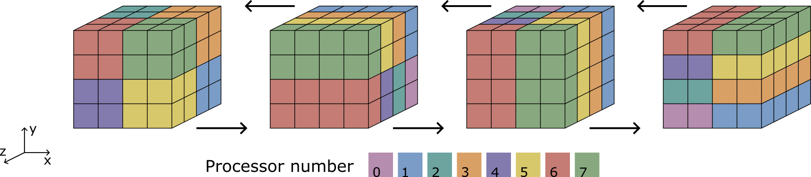

# Chapter 7: Linear system solvers

[Back to the table of contents](./0_start.md)

Briscola disposes of several solvers which can be used to solve linear systems.
These solvers are part of the `briscolaFiniteVolume` library and can be found
in

`src/briscolaFiniteVolume/solvers`

Selecting which solver is used for which solved variable is done in the
`briscolaSolverDict` file in the `system` folder of a Briscola case. The file
generally looks more or less like this:

```
FoamFile
{
    version     2.0;
    format      ascii;
    class       dictionary;
    object      briscolaSchemesDict;
}

U
{
    type        MG; // Geometric multigrid solver
    relTol      1e-5;
    tolerance   1e-8;
    maxIter     100;
}

p
{
    type        FFT; // FFT Poisson solver
}

```
where for each solved variable (here, `U` and `p`), the solver type is
specified, along with any additional entries needed for the solver. In this
chapter, the different solvers implemented in Briscola are explained.

## Geometric multigrid solver
Briscola's brick-structured design and data structure allows it to use the
geometric multigrid solver to efficiently solve linear systems. The geometric
multigrid solver is an iterative linear system solver which uses one or several
coarser grids in order to obtain a solution on the main (finest) grid. In
brief, the solution procedure for an unknown variable $x$ is as follows:

1. Pre-smoothing: Starting from a discrete linear system of the form $Ax=b$
as well as an initial guess $x_0$, high-frequency errors are smoothed out
(e.g., using Gauss-Seidel iterations) to obtain an approximate solution
$x_a$. This approximation $x_a$ has an error $\xi_a$ defined as
$ \xi_a \equiv x - x_a $.
2. Restriction: After the high-frequency errors have been smoothed out, the
residual $r_a$ of the equation is computed, and is restricted to a coarser
grid. The residual $r_a$ is defined as $ r_a \equiv b - A x_a $. The coarser
grid generally has cells twice as large in each spatial direction compared to
the original grid.
3. Defect equation: On the coarser grid, a defect equation is formulated. The
defect equation has the following form: $ A \xi_a = r_a $
4. Smoothing and restriction: The defect equation is further smoothed, then
restricted to even coarser grids recursively until the coarsest grid level has
been reached. On the coarsest grid, the defect equation can be solved using a
direct solver, or using smoothing.
5. Prolongation and post-smoothing: The solution of the defect equation, which
gives the correction on the finer grid, is prolonged to the finer grid, where
the correction is applied. This is done recursively until the correction
reaches the finest grid, where the correction is applied to $x_a$.
Additional post-smoothing sweeps may be applied to the solution after
prolongation as well.
6. Iteration: Several such multigrid cycles may be performed until the solution
on the original (finest) grid reaches the desired residual tolerance. The
number of times and order in which different grid levels are visited during the
multigrid cycle can be changed to obtain different cycle types. In Briscola,
the F-cycle is the default due to its good convergence properties, but V- and W-
cycles can also be selected.


The above figure graphically shows the hierarchy of grid levels and the
direction of restrictions and prolongation operations for a three-grid cycle.

The use of `meshLevel`s in Briscola is closely related to the geometric
multigrid solver, as a `meshLevel` contains the values of a `meshField` at a
specific grid level within the multigrid solver. Also the coefficient matrix
$A$, which is defined as a `meshField` of stencils, contains the coefficients
for each of the grid levels.

The geometric multigrid solver can be selected in `briscolaSolverDict` with its
type name '`MG`', and it requires the user to specify a desired absolute and
relative residual tolerance (`tolerance` and `relTol`). The following optional
additional entries can also be specified:

* `minIter` and `maxIter`: minimum and maximum number of multigrid cycles per
`solve()` call. Defaults to 0 and 999 respectively
* `nSweepsPre` and `nSweepsPost`: number of pre- and post-cycle smoothing
sweeps. Defaults to 0 and 2 respectively.
* `cycleType`: type of multigrid cycle (`F`, `V` or `W`). Defaults to `F`.
* `coarseMode`: solve mode for the coarsest grid level (`direct` or `smooth`).
Defaults to `direct`.
* `smoother`: smoother type. Three different types of smoothers are available
in Briscola: the Jacobi smoother (`JAC`), the lexicographical Gauss-Seidel
smoother (`LEXGS`) and the red-black Gauss-Seidel smoother (`RBGS`). Defaults
to `RBGS`.

## FFT Poisson solver

For Poisson equations, Briscola also has an FFT-based direct solver. In many
cases, this solver is significantly faster than the multigrid solver, and it
gives a solution to the discrete equation which is accurate up to machine
precision. The FFT Poisson solver can only be used under the following
criteria:

* The mesh is rectilinear
* Mesh cells are uniformly sized in at least two spatial directions
* No immersed boundary conditions are applied to the Poisson equation
* The Poisson equation is of the form $\nabla^2 x=b$ (`im::laplacian(x)=b`)
with `x` the unknown meshField and `b` the right hand source meshField. For
Poisson equations with variable coefficients (i.e., $\nabla(\lambda\nabla x)=b$
or `im::laplacian(lambda,x)=b`), the split Poisson solver may be used.

The main motivation behind the implementation of the FFT Poisson solver is for
the solution of the pressure Poisson equation which is common when using the
projection method to solve the incompressible Navier-Stokes equation. This
equation has the following form:

$ \nabla^2 p^{n+1} = \frac{\nabla \cdot \mathbf{u^*}}{\Delta t} $,

where $\mathbf{u^*}$ is the preliminary velocity solution and $\Delta t$ is the time
step. The solution to this equation, $p^{n+1}$ gives the pseudo-pressure field
onto which the preliminary velocity must be projected in order to make it
divergence-free. Due to the elliptic nature of this equation, solving it with
iterative solvers is often computationally very expensive. With the use of
Fourier expansions, this equation can be diagonalized allowing for a fast and
direct solution instead. The FFT solver goes through the following steps to
solve a three-dimensional Poisson equation:

1. The Poisson equation is transformed in two spatial directions using FFT's,
reducing the heptadiagonal linear system to a tridiagonal one.
2. The tridiagonal system is solved using the Thomas algorithm (also known as
the TDMA) in the untransformed direction, giving the solution in Fourier space.
3. The inverse transforms are applied in the same two directions, yielding the
solution in real space.

The mesh must be uniform in the two transformed directions (a requirement for
Fourier transforms), while the Thomas algorithm also works with non-uniform
mesh spacing. In practice, Briscola automatically selects the directions which
are transformed and the direction which is solved with the Thomas algorithm for
a given mesh.

For parallel computations, an additional constraint is that data must be
contiguously contained on a single processor in the transformed/solved
direction. For example, to apply the FFT in x-direction, there can not be any
parallel decomposition in x-direction. In order to still allow for the use of
the FFT solver for parallel computations, pencil decomposition is used. A
pencil decomposition is simply a parallel decomposition in two out of three
spatial directions, where the third spatial direction is not decomposed. A
parallel FFT solution procedure (assuming an initial decomposition in all
three directions) therefore cycles through x-, y- and z-pencil decompositions
as follows:
1. Values are transposed across processors to go from the initial data
decomposition to a pencil decomposition in the first transform direction.
2. After the first FFT, values are transposed again to obtain a pencil
decomposition in the second transform direction.
3. After the second FFT, values are transposed to obtain a pencil decomposition
in the tridiagonal solve direction.
4. After solving the tridiagonal system, we go back through the pencil
decompositions in reverse order.
5. Finally, values are returned to their original processors to obtain the
solution in the initial decomposition.

A typical pencil decomposition cycle is depicted below:



The main class implementing the FFT solver is `FFTPoissonSolver`
(see `FFTPoissonSolver.H`). Besides this class, a number of additional classes
in the `FFT` namespace implement specific parts of the solution procedure:
* `planner`: This class identifies the optimal order of operations, i.e., which
spatial directions to transform and which to solve for, as well as the order in
which this should be done. It uses information about the mesh as well as the
initial decomposition to do this.
* `FourierTransforms`: This class interfaces with [FFTW](https://fftw.org), the
external library used for the FFT's. It identifies the boundary conditions of
the Poisson problem, selects and prepares the specific transform type
(depending on the boundary conditions, sine and cosine transforms can also be
used besides Fourier transforms) and calls the relevant FFTW routines to
execute the transforms.
* `pencilDecomposer`: This class defines the pencil decompositions based on the
mesh and the initial decomposition. It also handles the transposing of data
between different decompositions. For this, it uses OpenFOAM's wrapper around
MPI_Alltoall (`UPstream::allToAll`).
* `processorOverlap`: For a given pair of parallel decompositions, this class
computes and saves communication variables required for the all-to-all (e.g.,
send and receive sizes, starting indices and displacements). The information is
saved such that it doesn't need to be determined again at every time step.
* `tridiagonalSolver`: This class implements the standard Thomas algorithm as
well as the modified Thomas algorithm for periodic tridiagonal systems. It also
computes the eigenvalues of the transforms as these eigenvalues appear in the
tridiagonal system.

### Split Poisson solver

The split Poisson solver allows for the use of the FFT solver for Poisson
equations with a variable coefficient. This is particularly important for the
pressure Poisson equation in a two-phase system with variable density:

$ \nabla \cdot (1/\rho^{n+1} \nabla p^{n+1}) = \frac{\nabla \cdot \mathbf{u}^*}{\Delta t} $

To solve this equation, we can split it into a constant coefficient part, which
is treated implicitly within the FFT solver, and a variable coefficient part
which is treated explicitly based on an explicit approximation of $p^{n+1}$.
This explicit approximation means that the solution obtained with the split
Poisson solver is an approximate one, unlike that of the standard FFT solver.
Briscola's split Poisson solver follows the method proposed by Dodd & Ferrante
[Dodd, M. S., & Ferrante, A. (2014). JCP, 273, 416-434.]

The implementation of the split Poisson solver
(see `src/briscolaFiniteVolume/solvers/PoissonSolvers/splitPoissonSolver`)
has two additions to the original method of Dodd & Ferrante. First, the
splitting method is generalized such that any `PoissonSolver` can be used to
solve the constant coefficient Poisson equation. While this may not have any
obvious use cases, this means that the constant coefficient Poisson equation
can also be solved with the multigrid solver rather than the FFT solver. The
second addition is the possibility to use pre-conditioning to improve the
explicit approximation for $p^{n+1}$. For example, a single multigrid V-cycle
can be used as pre-conditioner before using the FFT solver. This would be done
as follows in `briscolaSolverDict`:

```
p
{
    type        split;

    solver // For the constant coefficient equation
    {
        type    FFT;
    }

    preconditioner // Pre-conditioner
    {
        type        MG;
        relTol      0;
        tolerance   0;
        maxIter     1;
        cycleType   V;
    }
}

```

From practical experience, it was found that the standard split Poisson solver
(i.e., with FFT's and without pre-conditioner) can lead to numerical
instabilities when used for the pressure equation in two-phase problems with
large density ratios.

## Eigen, PETSc and SuperLU

Solvers from these external libraries can also be used in Briscola. From PETSc,
 the different Krylov solvers can be accessed with the `Krylov` class
(see `src/briscolaFiniteVolume/solvers/Krylov`). More details on PETSc's Krylov
solvers can be found [here](https://petsc.org/main/manualpages/KSP/KSPType/).

A number of direct solvers are also available through the Eigen and PETSc
libraries. These solvers can be found in
`src/briscolaFiniteVolume/solvers/directSolvers/Eigen/EigenSolvers` and
`src/briscolaFiniteVolume/solvers/directSolvers/PETSc/PETScSolvers`
respectively. If SuperLU is also installed when compiling Briscola, its direct
solvers become available through its Eigen and PETSc interfaces.

[Back to the table of contents](./0_start.md)
